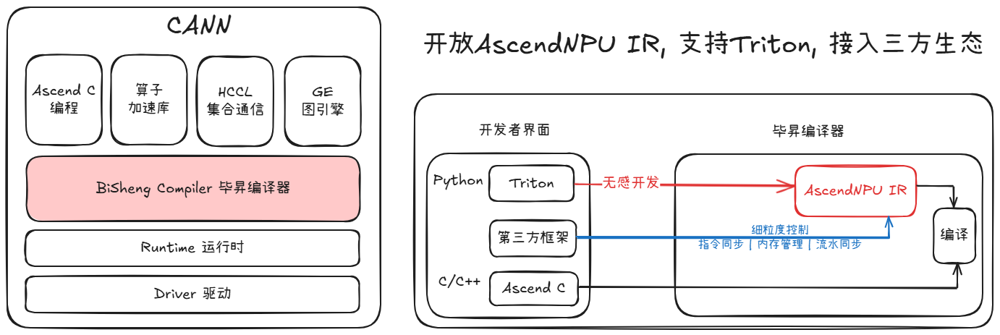

## 🎯 Introduction

AscendNPU IR (AscendNPU Intermediate Representation) is built on MLIR (Multi-Level Intermediate Representation). It serves as an intermediate representation for compiling Ascend-compatible operators and provides comprehensive Ascend expression capabilities. It enhances the computational efficiency of Ascend AI processors through compilation optimization and supports deep tuning via ecosystem frameworks.

AscendNPU IR offers multi-level abstraction interfaces: it provides a series of high-level abstraction interfaces encapsulate Ascend computation, data movement, and synchronization instructions. The compilation optimizations automatically detect hardware architecture, map hardware-agnostic expressions to underlying instructions to enhance operator development ease. Additionally, it provides fine-grained performance control interfaces, enabling precise control over on-chip memory addresses, pipeline synchronization insertion points, ping-pong pipeline optimization activation, and allowing granular performance control.

AscendNPU IR supports flexible integration with ecosystem frameworks and efficiently enabling Ascend AI processors through open interfaces via the open-source community.

## 🔍 Repository Structure
Key directories within the AscendNPU IR repository are as follows:
```
├── bishengir            // Source code directory
│   ├── cmake
│   ├── include          // Header files
│   ├── lib              // Source file
│   ├── test             // Test cases
│   |  └── Integration   // E2E use cases
│   └── tools            // Binary tools
├── build-tools          // Build tools
├── CMakeLists.txt
├── docs                 // Documentation
├── LICENSE
├── NOTICE
├── README.md
└── README_zh.md
```

## ⚡️ Quick Start

For build instructions, see: [How to Build](./docs/HowToBuild.md)

For an example of building E2E cases, see: [README.md](./bishengir/test/Integration/README.md)

| Example Name | Guide |
|------|------|
| HIVM VecAdd |  [VecAdd README.md](./bishengir/test/Integration/HIVM/VecAdd/README.md) |

## 📝 Version Compatibility Notes
Please refer to the relevant sections of the [CANN Community Edition Documentation](https://www.hiascend.com/document/detail/zh/CANNCommunityEdition/800alpha003/softwareinst/instg/instg_0001.html) for installation and preparation of Ascend hardware, CANN software, and corresponding deep learning frameworks.

## 📄 License
[Apache License v2.0](LICENSE)