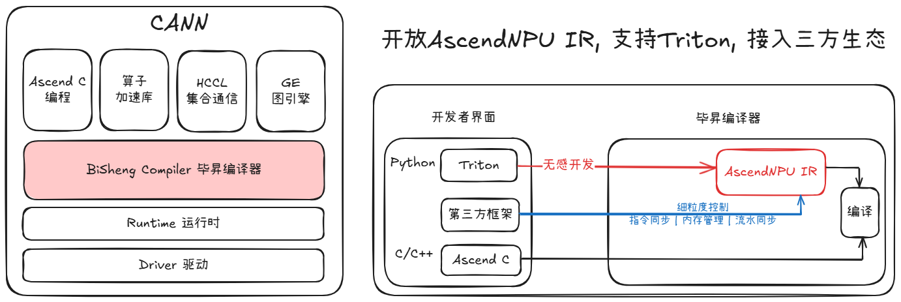

# AscendNPU IR（BiSheng IR）项目

## AscendNPU IR（BiSheng IR）在CANN中的位置



## 使用AscendNPU IR（BiSheng IR）

### 安装构建BiSheng IR所需的预编译组件

1. 将包含与您的目标机器对应的预编译组件的包（可在[发布页面](https://gitee.com/ascend/ascendnpu-ir/releases)获取）解压到任意位置。在安装后，它应当包含如下内容：

   ```bash
   ├── lib
     └── libBiShengIR.so     // used to build bishengir dialects
   └── bin
     └── bishengir-compile   // used to compile `.mlir` to binary
     └── bishengir-yaml-gen  // used to generate files from yaml
   ```

2. 将环境变量设置为安装路径：

  ```bash
  export BISHENG_IR_INSTALL_PATH= ...
  ```


### 将BiSheng IR构建为外部LLVM项目

1. 查找构建BiSheng IR所依赖的LLVM版本。请查看`cmake/llvm-release-tag.txt`文件获取当前版本信息。
  
    例如，若显示"llvm.19.1.7"，意味着您当前版本的BiSheng IR需要基于[LLVM](https://github.com/llvm/llvm-project/tree/llvmorg-19.1.7)的`llvmorg-19.1.7`发行版构建。

2. 使用`git checkout`命令签出到此版本。根据需要，您可以对LLVM进行额外修改。

3. 将`bishengir`项目作为第三方子模块添加到LLVM

    ```bash
    git submodule add https://gitee.com/ascend/ascendnpu-ir.git third-party/bishengir
    ```

4. [构建LLVM](https://llvm.org/docs/CMake.html)。例如，您可以运行以下命令：

    ```bash
    cd ${HOME}/llvm-project  # your clone of LLVM.
    mkdir build
    cd build
    cmake -G Ninja -DCMAKE_BUILD_TYPE=Release ../llvm \
      -DLLVM_ENABLE_PROJECTS="mlir;llvm" \
      -DLLVM_EXTERNAL_PROJECTS="bishengir" \
      -DLLVM_EXTERNAL_BISHENGIR_SOURCE_DIR=${HOME}/llvm-project/third-party/bishengir \
      -DBISHENG_IR_INSTALL_PATH=${BISHENG_IR_INSTALL_PATH}
    ```

5. 执行以下命令来编译和执行单元测试：

   ```bash
   cmake --build . --target "check-bishengir"
   ```

### 如何构建端到端用例

请查看 `examples` 目录。
